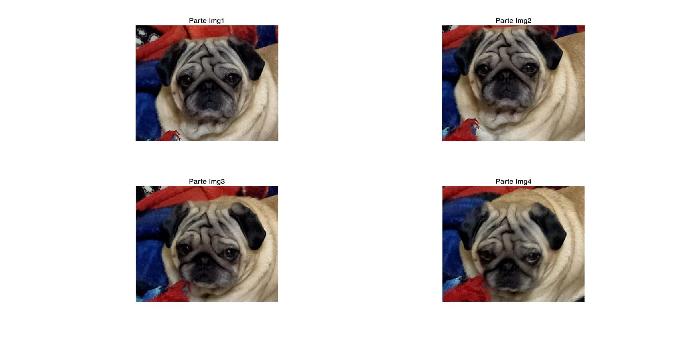
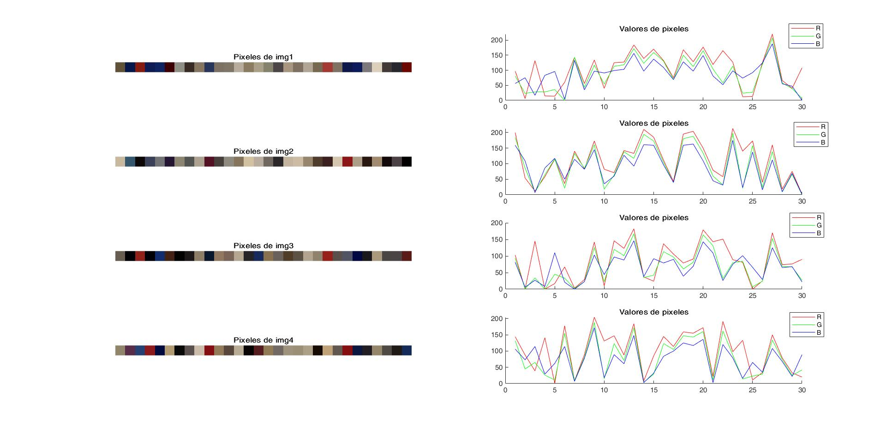

# Introducción
Se plantea leer cuatro imágenes diferentes de un mismo objeto y de estas obtener una zona de interes y obtener 30 pixeles aleatorios de cada imagen y graficar los valores de los mismos; por lo cual es necesario saber:

## ¿Qué es el procesamiento digital de imagenes (PDI)?
PDI se puede definir como el conjunto de procesamientos que se realizan sobre una imagen digital ya sea para realizar su almacenamiento, transmisión o tratamiento.

## Lectura de imágenes en matlab
Para leer una imágen en matlab se utiliza la función <a href="https://la.mathworks.com/help/matlab/ref/imread.html"> **imread**</a> y se asigna a una variable que representara a la imágen

<code>imagen = imread('ruta/nombre de la imágen.extensión');</code>

## Acceso a un pixel y regiones en las imagenes
El acceso a un pixel es una de las operaciones más comunes en visión computacional y en Matlab es algo muy simple; solo bastara con indexar el pixel de interés.

<code>pixel=imagen(Fila,Columna)</code>

## Mostrar una imágen
La función <a href="https://la.mathworks.com/help/images/ref/imshow.html?searchHighlight=imshow&s_tid=srchtitle_imshow_1">**imshow**</a> permite mostrar una imágen abierta, modificada o creada desde matlab (la imagen se visualiza en una ventana de matlab)

<code>imshow(imagen)</code>

## Guardar una imágen
Para guardar el contenido de una imagen la cual ha sido modificada o creada en matlab se utiliza la función <a href="https://la.mathworks.com/help/matlab/ref/imwrite.html?s_tid=doc_ta">**imwrite**</a>

<code>imwrite(variable,'nombre del arvhivo.extención')</code>

En donde 'variable' representa la variable que contiene a la imágen, 'nombre del archivo', el nombre con el que se desea guardar seguido de un punto se indica el tipo de formato deseado

## Resultados
Una vez que se han obtenido las partes de interes de cada imágen se procede a mostrarlas

Para lograr poner las cuatro imágenes en una sola ventana de matlab se uso la función <a href="https://la.mathworks.com/help/matlab/ref/subplot.html">**subplot()**</a>, gracias a esta función se puede dividir la ventana en una cuadrícula de **m** por **n** creando ejes en la posición que especifica **p**

<code>subplot(m,n,p)</code>

Para la obtención de los pixeles aleatorios se uso la función <a href="https://la.mathworks.com/help/matlab/ref/randi.html?s_tid=doc_ta">**randi()**</a>, la cual nos retorna números enteros pseudoaleatorios distribuidos uniformemente; para esto el primer valor **lim** representa el valor máximo que se puede obtener, **min** el valor minimo que se puede obtener y finalmente **rep** que le dice a la función cuantas veces realizara el proceso

<code>randi(lim,min,rep)</code>

Tras obtener los pixeles aleatorios los mostramos y obtenemos sus valores en el plano **RGB** quedando de la siguiente forma

<a href="https://github.com/ArturoEmmanuelToledoAguado/Img_Pixel">Código</a>